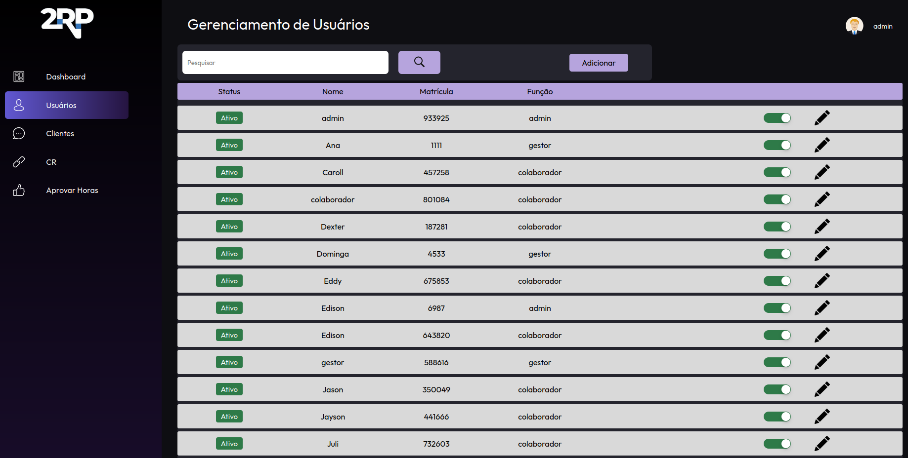

# Sobre mim

Me chamo Willian Danko, tenho 21 anos e sou graduando em banco de dados pela fatec São José dos Campos

Profissionamelte atuo como programador PLC voltaod par a na Axis Solutions.

 

# Gestão de horas laborais

Esse portifólio foi construido com base nos registros presentes no [repositório](https://github.com/codecatss/API-BD3?tab=readme-ov-file#sobre) do GitHub onde esse projeto foi desenvolvido. Resumidamente esse projeto tem por objetivo o desenvolvimente de um sistema para a __gestão de horas__ de uma empresa.

O sistema foi pensado para ter a possibilidade de poder centralizar o lançamento de horas trabalhadas dos funcionários daquela empresa. Os funcionarios dentro do sistema tem a possibilidade de centralizar o lançamento de suas horas trabalhadas e também monitorar o status de seus lançamentos. Os gestores podem fazer a gestão dos menbros de suas equipes, desde a inclusão e exclusão de membros as equipes, além de poder exportar relatórios sobre suas equipes. Já os administradores representavam o cargo de usário master no sistema, podendo fazer a demissão dos funcionarios e o controle dos gestores.

## Tecnologias Utilizadas

### Tecnologias 

- Spring Boot
- Hibernate
- Postman 
- Dbever      
- PostgreSQL  
 
### Linguagens

- Java
- Javascript
- HTML & CSS

#### Sobre a empresa

A empresa parceira desse projeto foi a 2RP, uma software house voltada para investigação de fraudes bancarioas em canais digitais e auditoria.

## Contribuições Pessoais
Durante o desenvolvimento deste projeto, fui responsável pela otimização das chamadas ao backend e ao banco de dados, resultando em tempos de carregamento e respostas mais rápidos. Além disso, contribuí para o planejamento da arquitetura do lado do servidor, tornando o projeto mais escalável e seguro. Também participei do desenvolvimento de funcionalidades como a gestão de equipes, extração de relatórios e o lançamento de horas extras pelos colaboradores.

Os imapactosde minhas contribuições podem ser resumidos no tópicos a seguir:

- Otimização de requisições  
- Construção de rotas independentes para consultas
- Implementação de views no banco para simplificar 
- Redução do trafego de dados em requisições do frontend
- Implementação de regras de negócio no client side para redução de tempo de resposta

## Hard Skills Desenvolvidas
As habilidades técnicas desenvolvidas em consequencia desse projeto foram várias, mas as mais evidentes foram as relacionadas a tratativa de dados e a implementação de regras de negócios do sistema 

- Data Transfer Object & ORM
- Arquitetura RESTfull 
- Spring security
- JWT

Essas atvidades me permitiram desenvolver minhas habilidades tecnicas, podendendo colocar em pratica conseitos e teorias que foram de grande valor para o enriquecimento de meu portifólio. 

# Backlog do produto

A aplicação foi triunfalmente entregue após 84 dias, sendo divida em 4 sprints de 21 dias.
A metodologia scrum foi implementada no desenvolvimeto desse projeto, seguindo uma tendencia de mercado, uma vez que essa modelo é amplamente usada no hambiente comercial.

O projeto foi dividido em 17 User stories que tinham a função de compartimentalizar as funções do projeto, parra poder guiar o desenvolvimento.

  

    <b>Milestones</b>
    <ul>
       <li>CRUD e funcionalidades básicas</li>
       <li>Gestão de equipes e extração de relatórios</li>
    </ul>
  

<table>
  <thead>
    <tr>
      <th>COMO</th>
      <th>GOSTARIA DE</th>
      <th>PARA</th>
      <th>PRIORIDADE</th>
      <th>SPRINT</th>
    </tr>
  </thead>
  <tbody>
    <tr>
      <td>Administrador</td>
      <td>Adicionar colaboradores e gestores, editar ou inativar</td>
      <td>Que o CR possa utilizar o sistema</td>
      <td>1</td>
      <td>1</td>
    </tr>
    <tr>
      <td>Administrador</td>
      <td>Adicionar novos clientes, editar ou inativar</td>
      <td>Que o CR possa utilizar o sistema</td>
      <td>2</td>
      <td>1</td>
    </tr>
    <tr>
      <td>Administrador</td>
      <td>Adicionar centro de resultado, editar ou inativar</td>
      <td>Que o CR possa utilizar o sistema</td>
      <td>3</td>
      <td>1</td>
    </tr>
    <tr>
      <td>Administrador</td>
      <td>Adicionar novos integrantes e nomear um gestor para um centro de resultado</td>
      <td>Que o CR possa trabalhar nos projetos</td>
      <td>4</td>
      <td>1</td>
    </tr>
    <tr>
      <td>Colaborador</td>
      <td>Lançar minhas horas extras</td>
      <td>Serem registradas e aprovadas por um gestor</td>
      <td>5</td>
      <td>1</td>
    </tr>
    <tr>
      <td>Colaborador</td>
      <td>Lançar meus sobreavisos</td>
      <td>Serem registradas e aprovadas por um gestor</td>
      <td>6</td>
      <td>1</td>
    </tr>
    <tr>
      <td>Gestor</td>
      <td>Lançar minhas horas extras</td>
      <td>Serem registradas e aprovadas por um Administrador</td>
      <td>7</td>
      <td>1</td>
    </tr>
    <tr>
      <td>Gestor</td>
      <td>Lançar meus sobreavisos</td>
      <td>Serem registradas e aprovadas por um Administrador</td>
      <td>8</td>
      <td>1</td>
    </tr>
    <tr>
      <td>Gestor</td>
      <td>Apontar ou não as horas lançadas por um colaborador</td>
      <td>Repassar ao RH</td>
      <td>9</td>
      <td>2</td>
    </tr>
    <tr>
      <td>Administrador</td>
      <td>Consultar e aprovar as horas extras e sobreavisos apontadas pelos gestores</td>
      <td>Serem pagas</td>
      <td>10</td>
      <td>2</td>
    </tr>
    <tr>
      <td>Usuário</td>
      <td>Acessar o sistema através da matrícula e senha</td>
      <td>Visualizar minha área de navegação</td>
      <td>11</td>
      <td>2</td>
    </tr>
    <tr>
      <td>Administrador</td>
      <td>Poder acessar as informações de parametrização</td>
      <td>Padronizar o sistema com valores a serem pagos pelas horas</td>
      <td>12</td>
      <td>2</td>
    </tr>
    <tr>
      <td>Colaborador</td>
      <td>Acessar meu painel de controle para visualizar informações sobre as horas já registradas, com a capacidade de filtrar por período, equipe e obter uma visão geral abrangente</td>
      <td>Gerenciar e monitorar minhas informações de lançamento individual.</td>
      <td>13</td>
      <td>3</td>
    </tr>
    <tr>
      <td>Gestor</td>
      <td>Acessar meu painel de controle para visualizar informações sobre as horas que já foram registradas, bem como detalhes sobre minha equipe. Além disso, desejo a capacidade de aplicar filtros às informações conforme necessário</td>
      <td>Acompanhar todas as minhas informações de lançamentos individuais, bem como monitorar informações relacionadas às equipes das quais sou gestor.</td>
      <td>14</td>
      <td>3</td>
    </tr>
    <tr>
      <td>Administrador</td>
      <td>Acessar o dashboard a fim de facilitar a visualização abrangente de informações compartilhadas entre colaboradores, gestores e centros de resultados, permitindo também a aplicação de filtros para uma análise mais precisa</td>
      <td>Monitorar o desempenho de todos os participantes do sistema</td>
      <td>15</td>
      <td>3</td>
    </tr>
    <tr>
      <td>Administrador</td>
      <td>Visualizar as horas com suas respectivas verbas selecionadas</td>
      <td>Realizar o pagamento adequado a cada hora lançada e aprovada</td>
      <td>16</td>
      <td>4</td>
    </tr>
    <tr>
      <td>Administrador</td>
      <td>Gerar um relatório com base nas informações e período que eu selecionar</td>
      <td>Exportar como CSV</td>
      <td>17</td>
      <td>4</td>
    </tr>
  </tbody>
</table>

## Sobre o projeto

