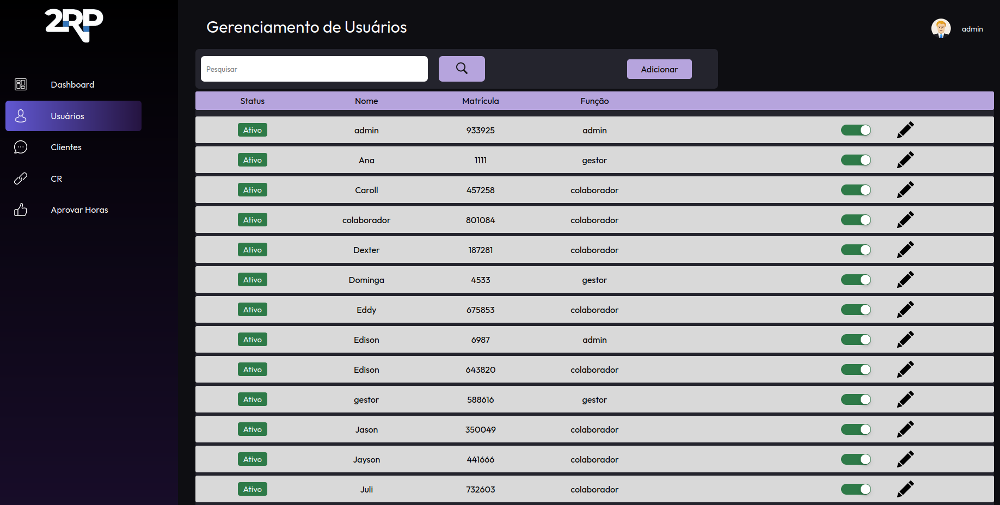

# *Portfolio apresentado como requisito avaliativo para a disciplina de Metodologia Científica*

Esse portifólio foi construido com base nos registros presentes no [repositório](https://github.com/codecatss/API-BD3?tab=readme-ov-file#sobre) do GitHub onde esse projeto foi desenvolvido. Resumidamente esse projeto tem por objetivo o desenvolvimente de um sistema para a __gestão de funcionários__ de uma empresa.

## Sobre a empresa

A empresa parceira desse projeto foi a 2RP, uma software house voltada para investigação de fraudes bancarioas em canais digitais e auditoria

## Problematização

Nos foi proposto o desafio de desenvolvermos para o cliente uma plataforma web para o gerenciamento dos lançamento de horas extras dos colaboradores da empresa.

# Backlog do produto

<table>
  

    <b>Milestones</b>
    <ul>
       <li>CRUD e funcionalidades básicas</li>
       <li>Gestão de equipes e extração de relatórios</li>
    </ul>
  

  <thead>
    <tr>
      <th>COMO</th>
      <th>GOSTARIA DE</th>
      <th>PARA</th>
      <th>PRIORIDADE</th>
      <th>SPRINT</th>
    </tr>
  </thead>
  <tbody>
    <tr>
      <td>Administrador</td>
      <td>Adicionar colaboradores e gestores, editar ou inativar</td>
      <td>Que o CR possa utilizar o sistema</td>
      <td>1</td>
      <td>1</td>
    </tr>
    <tr>
      <td>Administrador</td>
      <td>Adicionar novos clientes, editar ou inativar</td>
      <td>Que o CR possa utilizar o sistema</td>
      <td>2</td>
      <td>1</td>
    </tr>
    <tr>
      <td>Administrador</td>
      <td>Adicionar centro de resultado, editar ou inativar</td>
      <td>Que o CR possa utilizar o sistema</td>
      <td>3</td>
      <td>1</td>
    </tr>
    <tr>
      <td>Administrador</td>
      <td>Adicionar novos integrantes e nomear um gestor para um centro de resultado</td>
      <td>Que o CR possa trabalhar nos projetos</td>
      <td>4</td>
      <td>1</td>
    </tr>
    <tr>
      <td>Colaborador</td>
      <td>Lançar minhas horas extras</td>
      <td>Serem registradas e aprovadas por um gestor</td>
      <td>5</td>
      <td>1</td>
    </tr>
    <tr>
      <td>Colaborador</td>
      <td>Lançar meus sobreavisos</td>
      <td>Serem registradas e aprovadas por um gestor</td>
      <td>6</td>
      <td>1</td>
    </tr>
    <tr>
      <td>Gestor</td>
      <td>Lançar minhas horas extras</td>
      <td>Serem registradas e aprovadas por um Administrador</td>
      <td>7</td>
      <td>1</td>
    </tr>
    <tr>
      <td>Gestor</td>
      <td>Lançar meus sobreavisos</td>
      <td>Serem registradas e aprovadas por um Administrador</td>
      <td>8</td>
      <td>1</td>
    </tr>
    <tr>
      <td>Gestor</td>
      <td>Apontar ou não as horas lançadas por um colaborador</td>
      <td>Repassar ao RH</td>
      <td>9</td>
      <td>2</td>
    </tr>
    <tr>
      <td>Administrador</td>
      <td>Consultar e aprovar as horas extras e sobreavisos apontadas pelos gestores</td>
      <td>Serem pagas</td>
      <td>10</td>
      <td>2</td>
    </tr>
    <tr>
      <td>Usuário</td>
      <td>Acessar o sistema através da matrícula e senha</td>
      <td>Visualizar minha área de navegação</td>
      <td>11</td>
      <td>2</td>
    </tr>
    <tr>
      <td>Administrador</td>
      <td>Poder acessar as informações de parametrização</td>
      <td>Padronizar o sistema com valores a serem pagos pelas horas</td>
      <td>12</td>
      <td>2</td>
    </tr>
    <tr>
      <td>Colaborador</td>
      <td>Acessar meu painel de controle para visualizar informações sobre as horas já registradas, com a capacidade de filtrar por período, equipe e obter uma visão geral abrangente</td>
      <td>Gerenciar e monitorar minhas informações de lançamento individual.</td>
      <td>13</td>
      <td>3</td>
    </tr>
    <tr>
      <td>Gestor</td>
      <td>Acessar meu painel de controle para visualizar informações sobre as horas que já foram registradas, bem como detalhes sobre minha equipe. Além disso, desejo a capacidade de aplicar filtros às informações conforme necessário</td>
      <td>Acompanhar todas as minhas informações de lançamentos individuais, bem como monitorar informações relacionadas às equipes das quais sou gestor.</td>
      <td>14</td>
      <td>3</td>
    </tr>
    <tr>
      <td>Administrador</td>
      <td>Acessar o dashboard a fim de facilitar a visualização abrangente de informações compartilhadas entre colaboradores, gestores e centros de resultados, permitindo também a aplicação de filtros para uma análise mais precisa</td>
      <td>Monitorar o desempenho de todos os participantes do sistema</td>
      <td>15</td>
      <td>3</td>
    </tr>
    <tr>
      <td>Administrador</td>
      <td>Visualizar as horas com suas respectivas verbas selecionadas</td>
      <td>Realizar o pagamento adequado a cada hora lançada e aprovada</td>
      <td>16</td>
      <td>4</td>
    </tr>
    <tr>
      <td>Administrador</td>
      <td>Gerar um relatório com base nas informações e período que eu selecionar</td>
      <td>Exportar como CSV</td>
      <td>17</td>
      <td>4</td>
    </tr>
  </tbody>
</table>

## Imagens do programa

